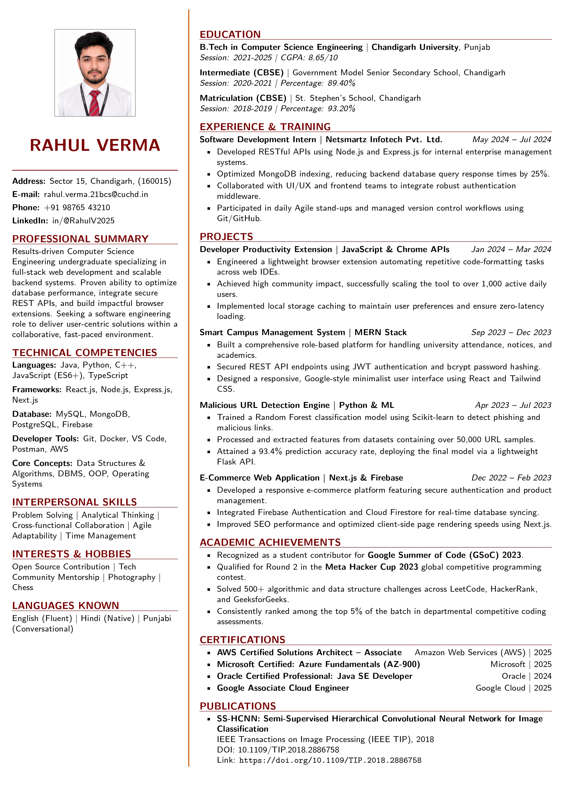

# CU Resume

Chandigarh University ATS-Friendly Resume Template built using LaTeX.

## Features

- ATS-Friendly Layout
- Chandigarh University Style Formatting
- One Page Resume Design
- Optimized Typography and Spacing
- Sidebar-Based Layout
- Software Engineering Focused
- Recruiter Friendly Structure
- Easy Customization

## Suitable For

- Chandigarh University Students
- Software Engineering Internships
- Campus Placements
- Full-Time Developer Roles
- Computer Science Students

## Preview

## How to Use

1. Upload your profile picture.
2. Edit personal information in `main.tex`
3. Replace project and experience details.
4. Compile using PDFLaTeX.

## Required Packages

- geometry
- graphicx
- xcolor
- enumitem
- hyperref
- titlesec
- tabularx

## Customization

You can easily modify:
- colors
- fonts
- spacing
- section titles
- project sections
- profile image